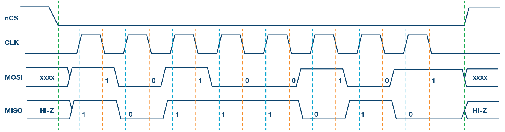
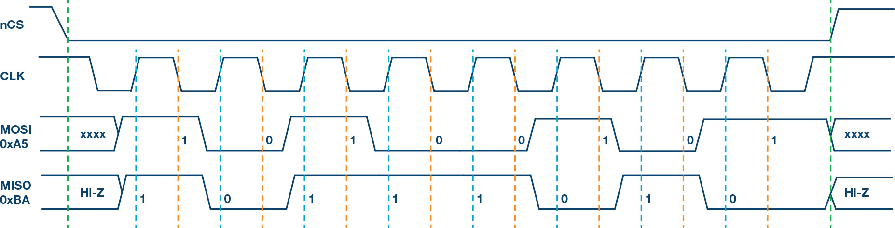
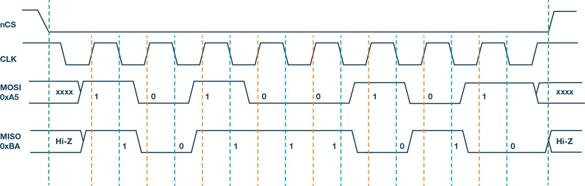

# Serial Peripheral Interface (SPI)

## Description: 

1. SPI utilizes four pins.
2. Data transmission begins when the slave select (SS) signal goes low.
3. Full-Duplex 

| Pin   | Name                   | Description                              |
|-------|------------------------|------------------------------------------|
| 1     | SCLK (Serial Clock)    | Clock signal generated by the master to synchronize data transmission. |
| 2     | MOSI (Master Out Slave In) | Data signal sent by the master to the slave device. |
| 3     | MISO (Master In Slave Out) | Data signal sent by the slave device to the master. |
| 4     | SS (Slave Select)      | Signal used by the master to select and enable communication with a specific slave device. Typically, it's low (active low) when the master wants to communicate with a particular slave and high when not in use. This pin is also sometimes called CS (Chip Select). |

These pins are essential for establishing communication between the master and slave devices in an SPI bus, allowing data to be transmitted and received in a synchronized manner.

## SPI Modes

| SPI Mode | CPOL | CPHA | Clock Polarity in Idle State | Clock Phase Used to Sample and/or Shift the Data |
|----------|------|------|-----------------------------|-------------------------------------------------|
| 0        | 0    | 0    | Logic low                   | Data sampled on rising edge and shifted out on the falling edge |
| 1        | 0    | 1    | Logic low                   | Data sampled on the falling edge and shifted out on the rising edge |
| 2        | 1    | 0    | Logic high                  | Data sampled on the falling edge and shifted out on the rising edge |
| 3        | 1    | 1    | Logic high                  | Data sampled on the rising edge and shifted out on the falling edge |

### Mode 0

1. CPOL = 0, 
2. CPHA = 0: 
3. CLK idle state = low 
4. Data sampled on rising edge (orange line)
5. Data change on falling edge (blue line)

### Mode 1

1. CPOL = 0, 
2. CPHA = 1: 
3. CLK idle state = low 
4. Data sampled on falling edge (orange line)
5. Data change on rising edge  (blue line)

### Mode 2

1. CPOL = 1, 
2. CPHA = 0: 
3. CLK idle state = high
4. Data sampled on falling edge (orange line)
5. Data change on rising edge  (blue line)

### Mode 3

1. CPOL = 1, 
2. CPHA = 1: 
3. CLK idle state = high
4. Data sampled on rising edge (orange line)
5. Data change on falling edge  (blue line)

## Example 

Hall based magnetic encoder sensor [MT6701](https://www.magntek.com.cn/upload/MT6701_Rev.1.0.pdf)

## Code 

- ESP32 based [implementation](../../code/ESP32/SPI) 
- STM32 based [implementation](Not done yet)

### Reference
More information can be found on:

* [Blog](https://www.analog.com/en/analog-dialogue/articles/introduction-to-spi-interface.html#:~:text=The%20CPOL%20bit%20sets%20the,bit%20selects%20the%20clock%20phase.)

* [Video](https://www.youtube.com/watch?v=ba0SQwjTQfw)